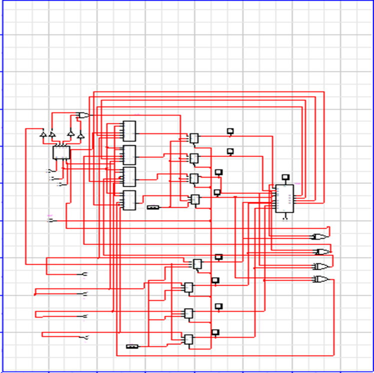

# ⚙️ Mini Computational Unit (MCU)

> 🛠️ **Implemented using:** LogicWorks  

---

## 🚀 Overview

This project implements a 4-bit **Mini Computational Unit (MCU)** that simulates core operations of a basic processor using fundamental combinational and sequential circuits. The system performs data loading, arithmetic, and logic operations using 2-bit operation codes (OPCODEs) and displays results via LEDs along with overflow and carry flags.

---

## 🧾 Features

- 🔢 Two 4-bit Registers (R0 and R1)  
- 🎛️ User-controlled data loading  
- ➕ 4-bit Addition  
- 🔀 Bitwise XOR  
- ⚠️ Overflow and 📤 Carry flag indicators  
- 🔘 LED output for result and flags  
- 🔄 Reset and ⏸️ Hold switches  
- 🔀 2-bit OPCODE selector  

---

## 🧠 OPCODE Table

| Group                | Opcode | Operation   | Source    | Destination | Description      |
|----------------------|--------|-------------|-----------|-------------|------------------|
| **Data Loading**     | `00`   | Load        | User      | R0          | `R0 ← U`         |
|                      | `11`   | Load        | User      | R1          | `R1 ← U`         |
| **Arithmetic & Logic** | `01`   | Addition    | R0, R1    | R0          | `R0 ← R0 + R1`   |
|                      | `10`   | Bitwise XOR | R0, R1    | R0          | `R0 ← R0 ⊕ R1`   |

---

## 🛠️ Hardware Components

Based on the final implementation:

- 🧠 **4-bit Registers:** 2 (R0 and R1)  
- 🔀 **4×1 Multiplexer:** 4 units  
- 🧮 **Full Adder (4-bit):** 1 unit  
- ⊕ **XOR Gates:** 4 units  
- 🎚️ **2×4 Decoder:** 1 unit  
- 🔘 **Switches:** User inputs and OPCODEs  
- 💡 **Probes/LEDs:** Output display  
- 🔁 **NOT gates, Clock, Reset lines**  

---

## 🎛️ Control & Operation

- **Data Loading:** Via switches into R0/R1 (using OPCODEs 00 or 11)  
- **ALU Operations:** Addition (01) or XOR (10), result stored in R0  
- **Overflow Detection (OV):** Difference between carry-in and carry-out of MSB  
- **Carry Flag (C):** Output from final adder bit  
- **Hold Switch:** Freezes the state of registers  
- **Reset:** Clears all registers and flags asynchronously

---

## 🖼️ Circuit Design

---

## 🧪 How to Simulate

1. Open `MCU.cct` using **LogicWorks**
2. Use 4-bit switches to input data  
3. Set 2-bit OPCODE to select operation  
4. Press reset (if needed)  
5. Observe output via LEDs and status flags

---

## 📈 Performance Notes

- ⚡ Fast and responsive execution for all instructions  
- ✅ Verified via simulation and testing  
- 🔄 Fully synchronous register behavior  
- 🧩 Modular and scalable design  
- 🧪 Experimental testing showed consistent and accurate results

---

## 📌 Key Learnings

> This project deepened understanding of digital design, especially in:  
> 🔹 Register-based architecture  
> 🔹 OPCODE control logic  
> 🔹 ALU design  
> 🔹 Flag implementation  
> 🔹 Synchronous vs asynchronous control  

---

